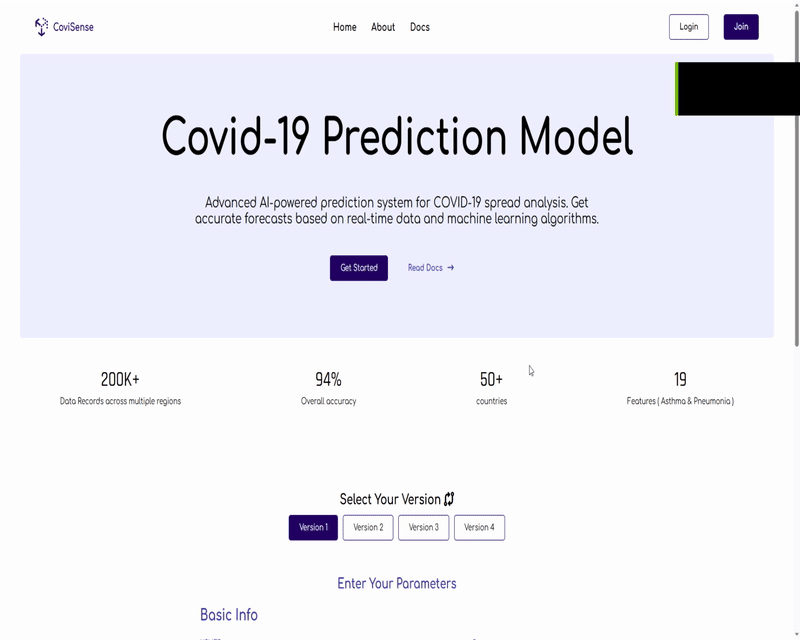

# 🧠 COVID-19 Prediction Model — DEPI Project

An AI-powered web application that predicts COVID-19 diagnosis outcomes based on medical and demographic inputs.

## 🚀 Overview

This project is an intelligent prediction system for COVID-19 using advanced machine learning models. The system receives patient health information and outputs a predicted classification (e.g., Confirmed, Suspected). The application provides **FIVE different prediction models (versions)** to compare performance and results.

---

## 🔗 Demo Link 
 ### https://funny-literate-chalk.glitch.me/

---

## 🎯 Targets
- **ICU**
- **Intubed**
- **Dead**
- **USMER**
- **Patient Type**

---

## 🛠️ Tech Stack

### 🧩 Backend
- **Flask** — Lightweight Python web framework
- **Machine Learning Models** — Trained COVID-19 classifiers

### 🎨 Frontend
- **HTML5**
- **CSS3**
- **JavaScript**

---

## 📦 Features

- ✅ User-friendly interface to input health data
- ✅ 5 different model versions for experimentation
- ✅ Real-time prediction on form submission
- ✅ Clean and responsive UI
- ✅ Deployed using Flask backend

---

## 📋 How It Works

1. User selects a version of the model.
2. Enters input features like age, sex, symptoms, etc.
3. Submits the form.
4. Flask backend receives data and returns a prediction from the selected model.

---

## 🖼️ UI Snapshot



---

## 🔧 Installation

```bash
# Clone the repo
git clone https://github.com/ibrahim-egy/COVID_DEPI.git
cd COVID_DEPI

# Create virtual environment (optional)
python -m venv venv
source venv/bin/activate  # on Windows: venv\Scripts\activate

# Install dependencies
pip install -r requirements.txt

# Run the app
python main.py
```

---
