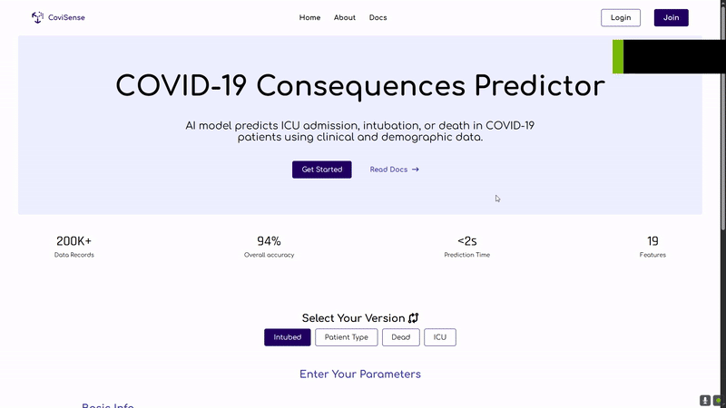

# 🧠 COVID-19 Prediction Model — DEPI Project

An AI-powered web application that predicts COVID-19 outcomes using demographic and clinical data. Built with Flask and JavaScript, the system offers **five different machine learning models** for comparative analysis, all integrated via **Hugging Face inference APIs**.

---

## 🌐 Live Demo

🔗 [View the Web App on Glitch](https://night-wind-sunshine.glitch.me/)

---

## 🎯 Prediction Targets (Models)

The application can predict the following outcomes:

- **ICU Admission**
- **Intubation**
- **Mortality (Dead)**
- **Patient Type**

---

## 🛠️ Tech Stack

### Backend
- **Flask** – Lightweight Python web framework
- **Hugging Face Inference API** – Deployed models used for prediction  
  📍 Endpoint: `https://jojoTH-covid.hf.space/predict`

### Frontend
- **HTML5**
- **CSS3**
- **JavaScript**

---

## 🚀 Features

- 🔘 Intuitive form for entering patient data
- 🔁 Selection of one of four prediction models
- 📡 Real-time predictions using Hugging Face APIs
- 📊 Displays prediction result with clear labels
- ✅ Fully responsive and mobile-friendly interface
- ☁️ Deployed with Glitch (Frontend + Backend)

---

## 🧪 How It Works

1. User selects one of the available prediction models.
2. Inputs relevant data (e.g., age, sex, symptoms, pre-existing conditions).
3. On form submission, the data is sent to the Flask backend.
4. Flask relays the data to the Hugging Face model endpoint.
5. The response (predicted outcome) is displayed to the user in real time.

---

## 🖼️ UI Preview



---

## ⚙️ Local Installation

To run the project locally:

```bash
# Clone the repository
git clone https://github.com/ibrahim-egy/COVID_DEPI.git
cd COVID_DEPI

# (Optional) Create and activate a virtual environment
python -m venv venv
source venv/bin/activate  # For Windows: venv\Scripts\activate

# Install Python dependencies
pip install -r requirements.txt

# Start the Flask application
python main.py
